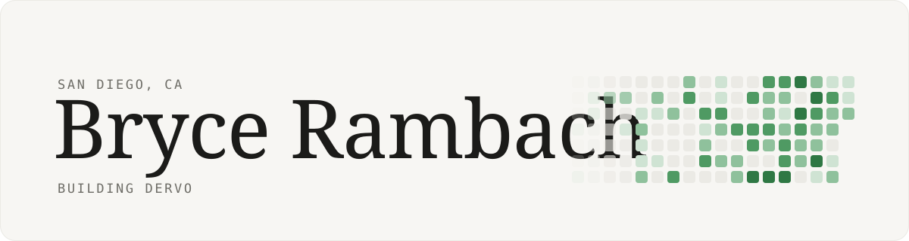
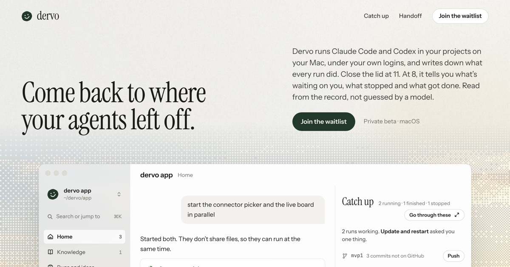

<picture>
  <source media="(prefers-color-scheme: dark)" srcset="assets/banner-dark.svg">
  
</picture>

Hey, I'm Bryce. I'm building [Dervo](https://trydervo.com).

Dervo runs Claude Code and Codex in your projects on your Mac, under your own logins, and writes down what every run did. So when you come back after a few hours, it tells you what's waiting on you, what stopped and what got done. It's in private beta on macOS right now.

During the day I build integrations and client portals at [Digital Directions](https://digitaldirections.io). I care a lot about how software feels, and I'm just as happy down in the backend making it work.

### Other things I've made

- **[thread](https://github.com/brambach/thread)**: a research project asking whether a model can keep track of what you're working on from your email, calendar and messages, with no upkeep from you.
- **[trace](https://github.com/brambach/trace)**: watches your local Claude Code sessions, makes every prompt searchable and shows how your prompting changes over time.
- **[port](https://github.com/brambach/port)**: an iOS ritual for putting your phone down at night.
- **[arro](https://github.com/brambach/arro)**: a private running-streak app for families.
- **[brycerambach.com](https://brycerambach.com)**: my portfolio, which you explore from the driver's seat of a green Porsche 911.

### Find me

[brycerambach.com](https://brycerambach.com) · [X](https://x.com/brycerambach) · [LinkedIn](https://www.linkedin.com/in/bryce-rambach/)
